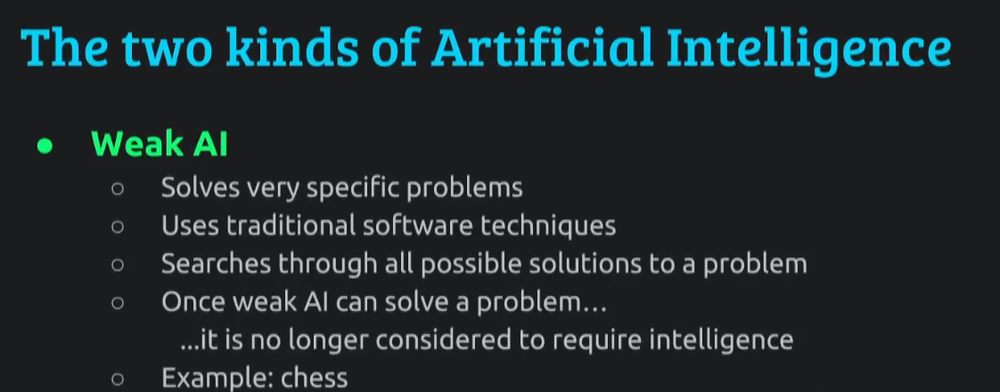
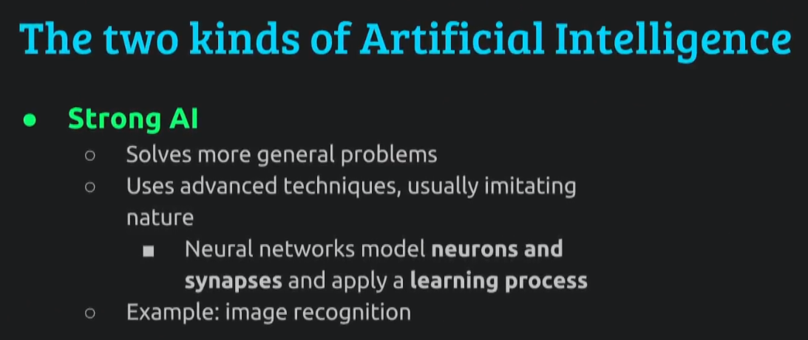
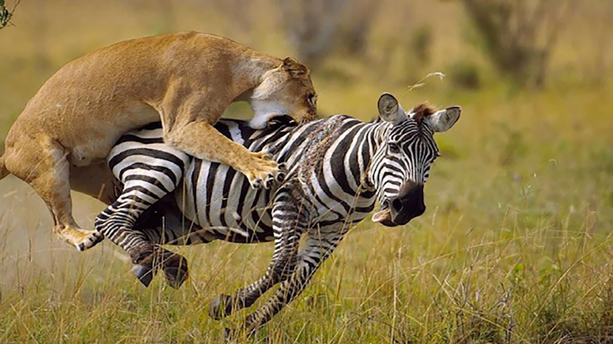
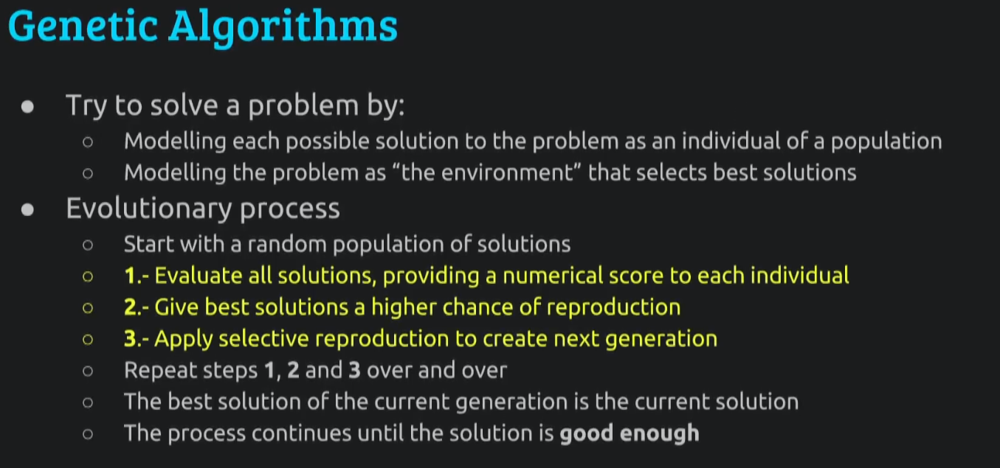
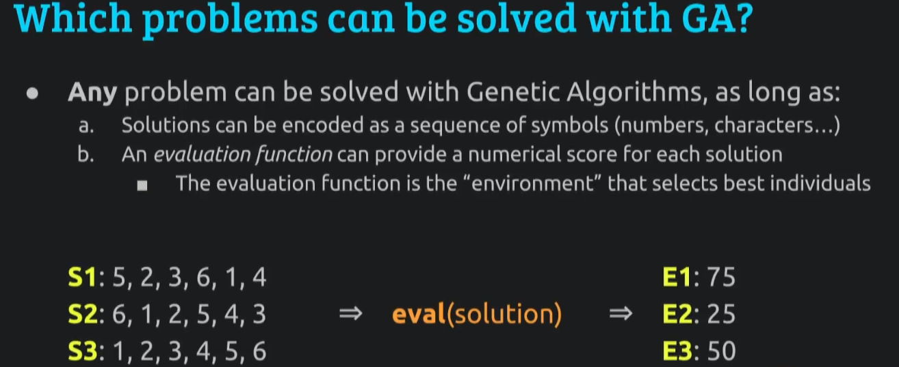
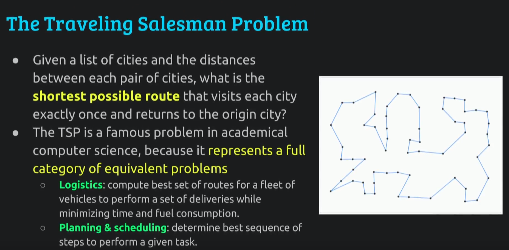
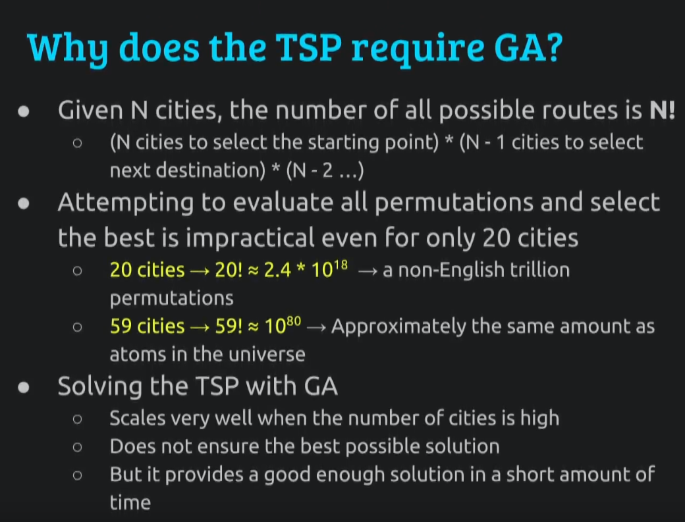
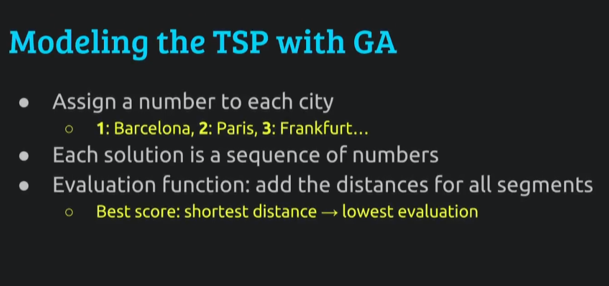
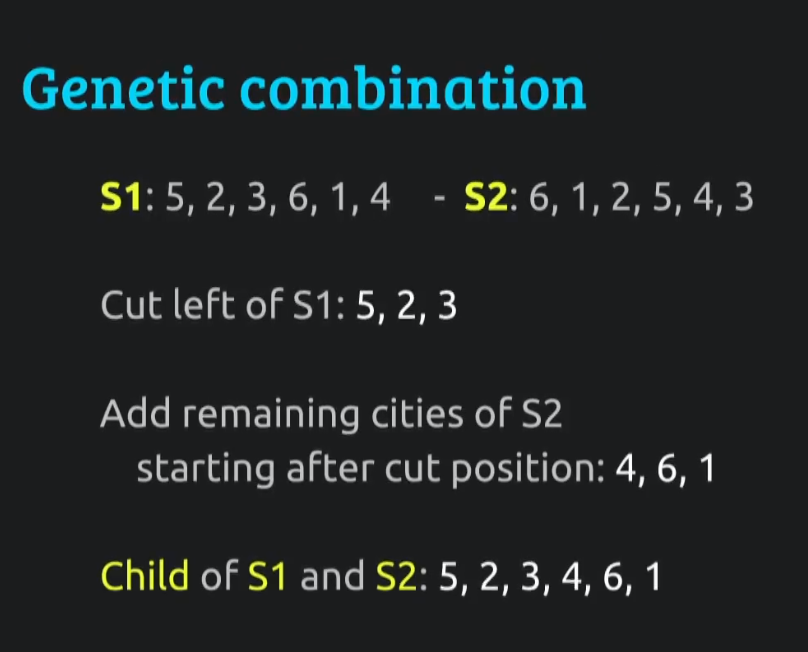

# Why XEL Community have to concentrate to GA algorithm

I'm going to talk about genetic algorithms, we will have a quick introduction to the different types of artificial intelligence, then I'll explain what are those genetic algorithms, what kind of problems they can be used for.

Solving which kind of problems and finally, I'll make a demo of XEL application that uses genetic algorithm technique for solving a special kind of problem.

So artificial intelligence is getting a lot of attention recently, why Is that so?
-----------------------------------------------

Well before that, we have to understand the different types of artificial intelligence.

There's weak (AI) and strong (AI) so the typical example of artificial intelligence is chess, 20 years ago a computer was able to defeat the best human player of chess, Garry Kasparov being defeated, and how did the program play chess?

well quite simple it computed all the possible moves of the next turn and the next turn and the next turn .. so that's a lot of different possible combinations but there's enough computing power for that there was enough like twenty years ago.

And that's not really thinking that's not really intelligent.

It's just brute force, so that's why it's called weak artificial intelligence.

Because when you look and how it's done.

It's just computing power, so every time we have a problem that we thought that required intelligence to solve it and we solve it by computation power using traditional algorithms.

Well, it's no longer considered to require intelligence and that's the limitation of weak artificial intelligence.

If we don't care that the computer is thinking if it is intelligent or not, but solve the problem that's good enough already.

-----------------------------------------------

But we have also strong artificial intelligence and in this case the techniques are more complex are more advanced and it usually tries to imitate nature and the most typical example is neural networks where the program is going to model neurons and synapses , and then there is a real learning process where the neural network is exposed to some examples then it will learn from them and then when you present a problem that it hasn't seen before it's able to respond from what it has learned before .

So just two years ago, a computer using neural networks was able to defeat one of the best human players of goal which is a game that not as easy as chess to win by brute force.

Because the board is much bigger there are many more moves so it's impossible to have so much computation power as to win by just computing the all possible moves.

So these neural networks were exposed to human games to of Go and after it learned it was also they made it play against itself and he'd learned from itself and then that way it learned strategies which were never imagined by a human.

I was asking, in the beginning, why is it that artificial intelligence getting so much interest now by big companies.

Well because in the past ten years ago making a big neural network especially deep neural networks with many neuron layers making it learn was very hard.

It took like months to make a neural network, a big one, learn them.

Then some guys discovered that technique that made it easier just from month to days and also we have of course much more computing power now.

For example, we can use graphics accelerators for computing in parallel so that you can propagate the signal through the network etc .. so that's why we can do things now that we couldn't do ten years ago like very good image recognition or winning Go.

---------------------------------------------

Anyway, after this introduction, I want to talk about genetic algorithms.

They also imitate nature they don't imitate the thinking process so you see in the strong AI.

The computer is really thinking because we have neurons we have synapse it's simulating the process of a real brain so we can really say it's thinking in a very simple way.

Because it's a very simplified model of a brain.

But it's already thinking.

Here we are going to imitate nature, by imitating evolution as a way to gradually get better and better. Lets quickly review how natural evolution works, we have a population of living beings and, every living being is built from a set of instructions that is just a sequence of genes and the ones that adapt better to the environment they can survive and they can have children and those children will inherit the characteristics.

There is also some diversity that helps make possibly slightly better children and slightly worse children and you combine that together and generation after generation you are going to have better and better adapt beings.

The typical case is the zebra so the slowest zebras they are eaten by lions. They cannot have children they die before they have children.

The faster ones they have children and those children will be slightly faster than the previous generation and that generation over the generation in thousands of years, You get faster and faster zebras and of course faster and faster lions which have to eat zebras.

-------------------------------------------

Okay, so we try to do the same thing for finding a solution that we couldn't solve by brute force.

Every individual of the population is a potential solution and the environment is the problem we want to solve.

We'll see how we do that.

How this works, we start with a random set of solutions, Just very ugly monsters that add up very badly to the environment and we select the best ones and we marry them to have children or well we just let them have children.

Best solutions have more children than the worst the worst also have children because it's good to have diversity.

But they have fewer and we iterate over and over and every generation we are going to have better solutions than in the previous one.

At any moment in time, we are in a given generation the solution to the problem is the best of the individuals in this generation.

So we keep iterating until we decide our solution is good enough or we find you know the user can decide when to stop or there has been like 10 minutes without an in the new solution or whatever.

 ----------------------------------------
 
 
What kind of problems can we be solved with this technique?

Pretty much anything that we can encode as a sequence.

You know the genetic information is a sequence so we can encode it in a sequence.

It can be numbered characters, it can be symbols, whatever.

We need to be able to encode it and we also need to have a way to evaluate which solution is better and which is worse.

We need to give a scoring, for example, this is still a little abstract but we have three solutions which are just three sequences of numbers.

We apply the evaluation function and we give different scores so this is like a lottery.

When we want them to have children E1 has more tickets to the lottery and E2 has fewer tickets, So E1 will be three times more likely to have children than E2 three times more children.

Every generation we do the same, this is a very abstract problem.

Let's see a specific example Traveling Salesman Problem which is a very typical problem.

----------------------------------------
 
 
We have a list of cities and we want to find the shortest route so this is a very famous problem because it's kind of academic problem for computation for techniques of finding solutions, but also because it is equivalent to other problems which are more useful like logistics.

We have you know big e-commerce with a lot of trucks, we want to give all the deliveries.

What is the best distribution of loads of things to put in trucks, where should each truck go?

It's a matter of recombining different possible solutions in a sequence and right planning.

So we have a set of tasks and people that need to do tasks and which is the best way to do that same thing.

This is only an example, there are many other problems that can be solved with genetic algorithms.

----------------------------------------
 
So again why do we need genetic algorithms instead of just other techniques?

well because when you have a lot of cities the complexity the number of possible computation is huge and it's n factorial.

You see take the first city you have impossible choices second city and minus 1 possible choice because you do 1 is taken and so on and this is this is huge.

With only 20 cities you have a trillion possible combinations and 48 cities you have about the same amount of possible combinations as atoms that are in the universe so this is an astronomical amount.

I did a little measurement in my computer and with 26 cities with the power of my computer, it would take longer than the age of the universe to compute all possible computer permutations.

My machine could be faster, we have XEL Platform that is thousand times faster.

But just add a couple more cities, already back to the same amount of time required.

So the good thing about genetic algorithms is that it scales very well.

You can add hundreds you can throw hundreds and hundreds of cities and it will quite quickly find a reasonable solution.

it's not going to be the best possible solution, we don't know, we cannot know if it's the best possible solution. 

But in a reasonable amount of time, we're going to have a pretty good one and we can wait and see if we get better ones over the generations.

---------------------------------------
 

How we do this specifically how we solve Traveling Salesman problem with genetic algorithms?

as I say before we need a way to encode.

So that's very easy, every city is a number.

How we do the evaluation function?

We just compute the distance, that's it.

For every sequence of cities, we compute the distance, the shortest routes are going to be better, and the longest ones are going to be worse so it's the opposite of the other example.

---------------------------------------
 
 
 
How we make children so we have a sequence of cities which is the parent and a sequence of cities which is the father and the mother?

so we can take the first half from the mother and the second half from the father and we stick them together.

But we have to skip the repetitions.

So 5 , 2 , 3 and 4 , 6 , 1 .

Pretty simple, that's a simplification.

We can add randomness we can cut not just in the middle we can cut somewhere else we can add mutations like we can flip some numbers etc... But in the end, you make children by just combining the sequences of two elements of the population.

Okay so, well because this is supposed to be about (ePL) Elastic Programing Language we are still on early stage.

Update are coming ASAP 

thank you for suport XEL-MAYC-ZZ3Y-YX56-6NH52
